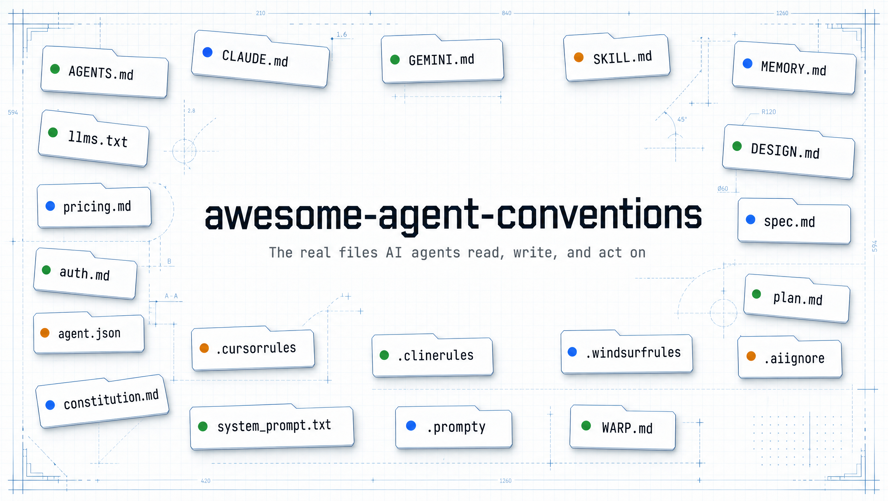

<!-- GENERATED by scripts/build_readme.py - do not hand-edit. -->
<!-- Edit scripts/targets.json (or per-convention pages), then re-run the script. -->

<p align="center">
  
</p>

# awesome-agent-conventions

<p align="center">
  <a href="https://awesome.re"></a>
  <a href="https://github.com/ItamarZand88/awesome-agent-conventions/actions/workflows/verify.yml"></a>
  <a href="LICENSE"></a>
</p>

**A collection of the real files AI agents read, write, and act on - extracted from production, organized by purpose, and labelled by how widely they're actually adopted.**

**21 conventions across 11 categories** - from the instruction files every coding agent reads to the discovery files the agent web is still inventing.

Not a glossary. Every entry links to a folder of *real files* pulled from public
sources by an extractor - so you can fork this and copy the actual artifact, not
a description of one.

## What counts

A file qualifies only if it is an **agent convention file**: it exists for an AI
agent to **read, write, or act on**. Any extension - `.md`, `.txt`, `.prompty`,
`.json`, dotfiles. Files written for humans (`README.md`, `CONTRIBUTING.md`,
`SECURITY.md`, `CHANGELOG.md`) are **out**.

## Maturity tiers

Every entry carries one tier, with evidence. Honest labelling is the whole point -
a proposed idea is never shown beside an adopted standard as if they were equal.

| Badge | Tier | Meaning |
| --- | --- | --- |
| 🟢 | **Adopted** | In production across multiple tools or teams. |
| 🟠 | **Emerging** | A real published spec from a real org, but early / limited adoption. |
| 🔵 | **Proposed** | A published concept with no demonstrated adoption (often one author staking a namespace). |

## Contents

- [Instruction & context](#instruction--context)
  - 🟢 [AGENTS.md](conventions/agents-md/)
  - 🟢 [CLAUDE.md](conventions/claude-md/)
  - 🟢 [Tool-specific instruction files](conventions/instruction-variants/)
- [Memory & state](#memory--state)
  - 🟢 [MEMORY.md](conventions/memory-md/)
  - 🟢 [Memory Bank](conventions/memory-bank/)
- [Spec-driven development](#spec-driven-development)
  - 🟢 [Spec Kit](conventions/spec-kit/)
  - 🟢 [Kiro steering files](conventions/kiro-steering/)
- [Skills & prompt assets](#skills--prompt-assets)
  - 🟢 [SKILL.md](conventions/skill-md/)
  - 🟢 [Prompt asset files](conventions/prompt-assets/)
  - 🟢 [Claude Code commands](conventions/claude-commands/)
  - 🟢 [Copilot prompt & instruction files](conventions/copilot-prompt-files/)
- [Tooling & connections](#tooling--connections)
  - 🟢 [MCP server config](conventions/mcp-config/)
- [Rules & ignore files](#rules--ignore-files)
  - 🟢 [Rules files](conventions/rules-files/)
  - 🟢 [AI ignore files](conventions/ignore-files/)
- [Design](#design)
  - 🟢 [DESIGN.md](conventions/design-md/)
- [Web & discoverability](#web--discoverability)
  - 🟢 [llms.txt](conventions/llms-txt/)
  - 🟢 [pricing.md](conventions/pricing-md/)
- [Agent-web trust](#agent-web-trust)
  - 🟠 [auth.md](conventions/auth-md/)
  - 🔵 [ai.txt](conventions/ai-txt/)
- [Identity & protocols](#identity--protocols)
  - 🟠 [Agent Cards (A2A)](conventions/agent-cards/)
- [Proposed namespace](#proposed-namespace)
  - 🔵 [The protocols.md namespace](conventions/proposed-protocols-md/)

## Instruction & context

| | Convention | Files | Read by | Spec |
| --- | --- | --- | --- | --- |
| 🟢 | [AGENTS.md](conventions/agents-md/) | `AGENTS.md` | Most coding agents - OpenAI Codex, Cursor, Jules, Aider, Gemini CLI, Zed, and others | [spec ↗](https://agents.md) |
| 🟢 | [CLAUDE.md](conventions/claude-md/) | `CLAUDE.md` | Claude Code, and tools that read the Claude memory convention | [spec ↗](https://code.claude.com/docs/en/memory) |
| 🟢 | [Tool-specific instruction files](conventions/instruction-variants/) | `GEMINI.md` `AGENT.md` `QWEN.md` `WARP.md` `CONVENTIONS.md` `copilot-instructions.md` | Each file is read by its namesake tool - Gemini CLI, Amp, Qwen Code, Warp, Aider, GitHub Copilot | [spec ↗](https://agents.md) |

- **[AGENTS.md](conventions/agents-md/)** - A plain-Markdown "README for agents" - build/test commands, conventions, and gotchas an agent needs before touching the code. The most widely adopted cross-tool instruction file.
- **[CLAUDE.md](conventions/claude-md/)** - Anthropic's memory file for Claude Code - loaded automatically at session start to carry project commands, style rules, and standing instructions across turns.
- **[Tool-specific instruction files](conventions/instruction-variants/)** - Per-tool instruction files that predate or coexist with AGENTS.md. Many tools now fall back to or symlink AGENTS.md, but these named variants are still read in the wild.

## Memory & state

| | Convention | Files | Read by | Spec |
| --- | --- | --- | --- | --- |
| 🟢 | [MEMORY.md](conventions/memory-md/) | `MEMORY.md` | Claude Code's auto-memory, and agent frameworks that persist a memory index | [spec ↗](https://code.claude.com/docs/en/memory) |
| 🟢 | [Memory Bank](conventions/memory-bank/) | `projectbrief.md` `productContext.md` `activeContext.md` `systemPatterns.md` `techContext.md` `progress.md` | Cline, Roo Code, and Cursor (via the Memory Bank custom-instructions pattern) | [spec ↗](https://docs.cline.bot/best-practices/memory-bank) |

- **[MEMORY.md](conventions/memory-md/)** - A persistent, agent-maintained index of durable facts - written and re-read across sessions so an agent accumulates project memory instead of relearning each time.
- **[Memory Bank](conventions/memory-bank/)** - Cline's structured memory system - a set of Markdown files an agent reads at the start of every task to reconstruct full project context after its session memory resets.

## Spec-driven development

| | Convention | Files | Read by | Spec |
| --- | --- | --- | --- | --- |
| 🟢 | [Spec Kit](conventions/spec-kit/) | `constitution.md` `spec.md` `plan.md` `tasks.md` | GitHub Spec Kit's slash-command agents (Copilot, Claude, Gemini, Cursor, and more) | [spec ↗](https://github.com/github/spec-kit) |
| 🟢 | [Kiro steering files](conventions/kiro-steering/) | `product.md` `structure.md` `tech.md` | AWS Kiro, and Kiro-compatible agents | [spec ↗](https://kiro.dev/docs/steering) |

- **[Spec Kit](conventions/spec-kit/)** - GitHub's spec-driven workflow - a constitution plus per-feature spec → plan → tasks files that drive an agent through structured, reviewable implementation.
- **[Kiro steering files](conventions/kiro-steering/)** - Kiro's always-on steering docs - product, structure, and tech files that give the agent persistent project context outside of any single spec.

## Skills & prompt assets

| | Convention | Files | Read by | Spec |
| --- | --- | --- | --- | --- |
| 🟢 | [SKILL.md](conventions/skill-md/) | `SKILL.md` | Claude (Agent Skills), Claude Code, and the open Agent Skills ecosystem | [spec ↗](https://agentskills.io) |
| 🟢 | [Prompt asset files](conventions/prompt-assets/) | `.prompty` `.prompt` `system_prompt.txt` | Prompty tooling, Azure AI / Semantic Kernel, and apps that load externalized prompts | [spec ↗](https://prompty.ai) |
| 🟢 | [Claude Code commands](conventions/claude-commands/) | `.md` | Claude Code - project .claude/commands/ and user ~/.claude/commands/ | [spec ↗](https://code.claude.com/docs/en/slash-commands) |
| 🟢 | [Copilot prompt & instruction files](conventions/copilot-prompt-files/) | `.prompt.md` `.instructions.md` | GitHub Copilot in VS Code / Copilot CLI | [spec ↗](https://code.visualstudio.com/docs/agent-customization/prompt-files) |

- **[SKILL.md](conventions/skill-md/)** - A self-contained, model-invoked capability: YAML frontmatter (name + description) tells the agent when to load it; the body teaches it how. Progressive disclosure keeps it cheap until needed.
- **[Prompt asset files](conventions/prompt-assets/)** - Externalized prompt files - Prompty's YAML-front-mattered .prompty, plain .prompt templates, and system_prompt.txt - that pull the prompt out of source code so it can be versioned and edited on its own.
- **[Claude Code commands](conventions/claude-commands/)** - A Markdown file Claude Code exposes as a /slash-command - a reusable, version-controlled prompt workflow, with optional frontmatter (allowed-tools, model, argument-hint) and $ARGUMENTS / shell / @file placeholders. Now converging with Agent Skills, but still widely committed in its own right.
- **[Copilot prompt & instruction files](conventions/copilot-prompt-files/)** - Modular, path-scoped Copilot context: *.instructions.md auto-attach to matching files via an applyTo glob, while *.prompt.md are reusable prompts you invoke by name - the granular cousins of a single .github/copilot-instructions.md.

## Tooling & connections

| | Convention | Files | Read by | Spec |
| --- | --- | --- | --- | --- |
| 🟢 | [MCP server config](conventions/mcp-config/) | `.mcp.json` | Claude Code, Claude Desktop, Cursor, VS Code / Copilot - any MCP host | [spec ↗](https://code.claude.com/docs/en/mcp) |

- **[MCP server config](conventions/mcp-config/)** - A JSON file that tells an agent which Model Context Protocol servers to launch and how (command, args, env) - making a project's tool and data integrations portable, shareable, and version-controlled across every MCP-capable client.

## Rules & ignore files

| | Convention | Files | Read by | Spec |
| --- | --- | --- | --- | --- |
| 🟢 | [Rules files](conventions/rules-files/) | `.cursorrules` `.mdc` `.clinerules` `.windsurfrules` | Cursor (.cursorrules / .mdc), Cline (.clinerules), Windsurf (.windsurfrules) | [spec ↗](https://cursor.com/docs/rules) |
| 🟢 | [AI ignore files](conventions/ignore-files/) | `.aiignore` `.cursorignore` `.codeiumignore` | JetBrains Junie (.aiignore), Cursor (.cursorignore), Codeium/Windsurf (.codeiumignore) | [spec ↗](https://cursor.com/docs/reference/ignore-file) |

- **[Rules files](conventions/rules-files/)** - Per-tool rule files that scope agent behavior - older single-file forms (.cursorrules, .windsurfrules) and newer directory-based, glob-scoped forms (.cursor/rules/*.mdc).
- **[AI ignore files](conventions/ignore-files/)** - gitignore-syntax files that fence an AI agent out of paths - secrets, vendored code, generated output - so they're never sent to the model as context.

## Design

| | Convention | Files | Read by | Spec |
| --- | --- | --- | --- | --- |
| 🟢 | [DESIGN.md](conventions/design-md/) | `DESIGN.md` | Google Stitch and, since the format was open-sourced, coding agents like Claude Code that consume a design spec | [spec ↗](https://github.com/google-labs-code/design.md) |

- **[DESIGN.md](conventions/design-md/)** - A structured, machine-readable design specification - tokens, components, and layout intent - that an agent reads to generate or keep UI consistent with an established system. Open-sourced by Google Labs in 2026 as a cross-tool draft spec.

## Web & discoverability

| | Convention | Files | Read by | Spec |
| --- | --- | --- | --- | --- |
| 🟢 | [llms.txt](conventions/llms-txt/) | `llms.txt` `llms-full.txt` _(pattern)_ | Docs sites publish it for LLM tools and crawlers - though no major provider has confirmed reading it | [spec ↗](https://llmstxt.org) |
| 🟢 | [pricing.md](conventions/pricing-md/) | `pricing.md` | Agents and LLM browsers fetching a clean, parse-able pricing page | [spec ↗](https://resend.com/pricing.md) |

- **[llms.txt](conventions/llms-txt/)** - A proposed-turned-widely-published standard: a root-level Markdown file giving LLMs a curated, link-rich map of a site's docs. Published across hundreds of developer-docs sites - though whether the major LLM providers actually read it remains unproven.
- **[pricing.md](conventions/pricing-md/)** - The Markdown twin of a pricing page - same URL with a .md suffix - so an agent gets structured plans and numbers instead of scraping marketing HTML. A concrete, shipping instance of the page.md pattern.

## Agent-web trust

| | Convention | Files | Read by | Spec |
| --- | --- | --- | --- | --- |
| 🟠 | [auth.md](conventions/auth-md/) | `auth.md` | Agents discovering how to authenticate to a service (early adopters) | [spec ↗](https://workos.com/auth-md) |
| 🔵 | [ai.txt](conventions/ai-txt/) | `ai.txt` | AI training-data crawlers that honor Spawning's opt-out (early adopters) | [spec ↗](https://site.spawning.ai/spawning-ai-txt) |

- **[auth.md](conventions/auth-md/)** - A Markdown file that tells an agent how to authenticate with a service - discovery of auth endpoints and flows. Shipped by WorkOS as a real, working convention, but adoption beyond it is still early.
- **[ai.txt](conventions/ai-txt/)** - A text file declaring machine-readable consent for AI training and data-mining of a site's content - a robots.txt analogue for the training era. A real spec from a real org (Spawning, tied to the EU TDM opt-out), but adoption is thin and live files use divergent schemas - labelled down to 🔵 until consumption is demonstrable.

## Identity & protocols

| | Convention | Files | Read by | Spec |
| --- | --- | --- | --- | --- |
| 🟠 | [Agent Cards (A2A)](conventions/agent-cards/) | `agent.json` | A2A-compatible agents discovering another agent's capabilities | [spec ↗](https://a2a-protocol.org/latest/specification/) |

- **[Agent Cards (A2A)](conventions/agent-cards/)** - The Agent2Agent (A2A) capability card - a JSON document at a well-known path advertising an agent's skills, endpoints, and auth so other agents can discover and call it. Now a Linux Foundation project at v1.0; adoption is growing but early.

## Proposed namespace

| | Convention | Files | Read by | Spec |
| --- | --- | --- | --- | --- |
| 🔵 | [The protocols.md namespace](conventions/proposed-protocols-md/) | `proof.md` | - (no demonstrated readers; aspirational) | [spec ↗](https://protocols.md) |

- **[The protocols.md namespace](conventions/proposed-protocols-md/)** - A single maintainer's pre-registered namespace of ~74 aspirational .md "protocols" (proof.md, signature.md, reputation.md, …) staked as Schelling points for a future agent web. Published concept, no demonstrated adoption - see the page for the audited, honest caveats.

## How the examples stay real

Example files are never hand-written - an extractor fetches them from public
sources and stamps each with a line-1 provenance comment. To refresh everything:

```bash
pip install -r scripts/requirements.txt
python scripts/extract.py          # fetch real files + rebuild each convention's README
python scripts/build_readme.py     # rebuild this README from scripts/targets.json
```

Re-running is idempotent and never crashes on a missing source - a dead target
just prints a `miss` and is skipped. Examples are representative samples: any
file over 256 KB (e.g. a multi-MB `llms-full.txt`) is truncated with a marker
pointing back to the full source. `scripts/targets.json` is the single source of
truth; edit it and re-run both scripts.

Every link is held to its promise by CI: a [GitHub Action](.github/workflows/verify.yml)
re-checks that the generated files are in sync with `targets.json` and that every
spec, example, and instance URL still resolves - on each pull request and weekly.
Run the same check locally with `python scripts/check_links.py`.

## Contributing

Read [CONTRIBUTING.md](CONTRIBUTING.md). In short: an entry must pass the filter
above and carry an evidenced maturity tier. Add your source to
`scripts/targets.json`, run the two scripts, and open a PR - don't hand-write
example files.

## License

[MIT](LICENSE).
